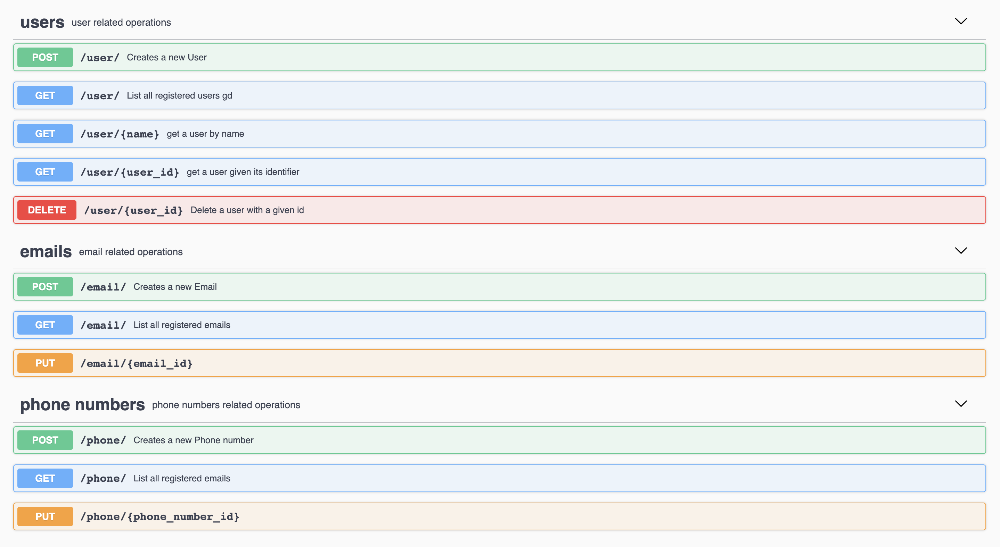

## User service


user rest-service for:
 - Creating a new user with contact data
 - Get user by Id and name
 - Add email/phone number
 - Update existing mail/phone data
 - Delete user

## Running the application in docker

- create a .env file in the project root and copy the contents of the .env.sample into it
- From here, run the following commands:

```
> docker-compose build
> docker-compose up
```
 
 ## Running the application locally
 Preferably, create a virtualenv and activate it, perhaps with the following command:

```
virtualenv -p python3 venv
source venv/bin/activate
```

Next, run
```
pip install -r requirements.txt
```

Next, run the database migrations

```
> python manage.py db init

> python manage.py db migrate --message 'initial database migration'

> python manage.py db upgrade
```
finally type ```python manage.py run``` to run the project
    
## Endpoints

You can import collection.json into postman to test the different endpoints.

You can test the hosted application [here](https://user-service-p.herokuapp.com/)

## Running Tests
To run the test suite, simply pip install it and run from the root directory like so

```
pip install pytest
pytest
```

## Room for improvement

Given more time, I would do the following to make the project better

- Add phone number validation, only email validation is implemented.
- Configure logging
- Configure Kubernetes using Amazon Elastic Kubernetes Service (EKS)
- Implement caching 